# Portfolio_2020
2020년 학교에서 만든 포트폴리오 웹사이트입니다.     
Three.js를 활용하여 세개의 축을 사용할 수 있다는 저의 강점을 살려 제작하였습니다.     

## 사용 언어
 - HTML, CSS, JavaScript, jQuery, Three.js     

### 중점 작업  
1. 미디어 쿼리와 display: flex; 를 사용하여 반응형 웹페이지를 제작하는데 집중하였습니다.     
2. jQuery를 활용하여 더 간결한 코드를 작성하였습니다.     
3. 3D 오브젝트와 효과를 넣어 공간감을 극대화 하였습니다.     

## 웹사이트 구성

### Main Page
페이지 로드 시 인트로 화면을 추가하여 저의 철학을 보여주었습니다.     
화면 중앙에는 3D 오브젝트를 배치 후 애니메이션을 주어 동적인 느낌을 살리려 하였습니다.     
추가로 Postprocessing BloomEffect를 추가하여 화사함을 더하였습니다.     

스크롤 시에는 프로젝트 썸네일을 보여주며 클릭 시 해당 상세 페이지로 이동할 수 있게 제작하였습니다.
우측에는 로고, 좌측에는 햄버거바를 제작하여 정리하였으며 햄버거바 클릭 시 나오는 네비게이션에는
About, Lab 페이지가 있으며 연락처를 적어놓은 Contact 버튼과 자기소개서를 다운받을 수 있는 Resume 버튼을 제작하였습니다.

JavaScript

    const mainGeo = new THREE.TorusKnotGeometry( 10, 1, 300, 9, 6, 14 );
    const mainMat = new THREE.MeshLambertMaterial({color : 0xedfaff, wireframe : false});
    const mainMesh = new THREE.Mesh(mainGeo, mainMat);
    mainMesh.scale.set(0.1, 0.1, 0.1);
    mainMesh.position.set(0, 0, 0);
    scene.add(mainMesh);

    let composer;
    composer = new POSTPROCESSING.EffectComposer(renderer);
    composer.addPass(new POSTPROCESSING.RenderPass(scene,camera));

    const effectPass = new POSTPROCESSING.EffectPass(
      camera,
      new POSTPROCESSING.BloomEffect()
    );
    effectPass.renderToScreen = true;
    composer.addPass(effectPass);

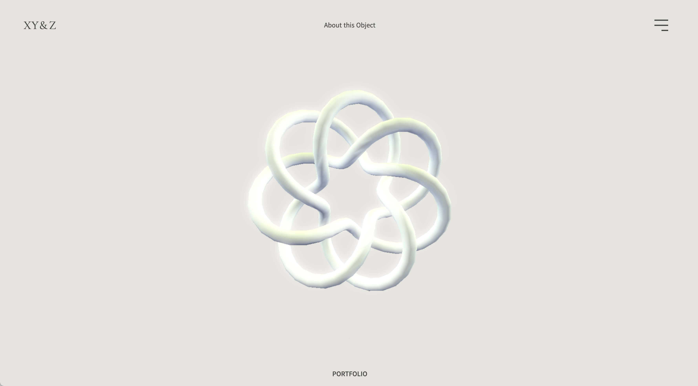

### Contact
제 연락처를 알려주기위하여 명함형태로 디자인 하였으며      
3D컨셉에 맞게 CSS와 JavaScript를 활용하여 마우스 인터랙션을 추가하였습니다.     

JavaScript

    document.addEventListener('mousemove', function(e){
        let card_x = getTransformValue(e.clientX,window.innerWidth,25);
        let card_y = getTransformValue(e.clientY,window.innerHeight,25);
        let text_shadow_x = getTransformValue(e.clientX,window.innerWidth,28);
        let text_shadow_y = getTransformValue(e.clientY,window.innerHeight,28);
        if(IS_MOBILE){

        }else{
            $(".floating").css("transform","rotateX("+card_y+"deg) rotateY("+card_x+"deg)  translateZ(60px)");
            $(".floating").css("box-shadow",-card_x+"px "+card_y+"px 55px rgba(255, 255, 255, .2)");
            $(".text").css("text-shadow",-text_shadow_x+"px "+text_shadow_y+"px 6px rgba(0, 0, 0, .3)");
        }
        
    });
    function getTransformValue(v1,v2,value){
        return (v1/v2*value-value/2).toFixed(1);                        
    }

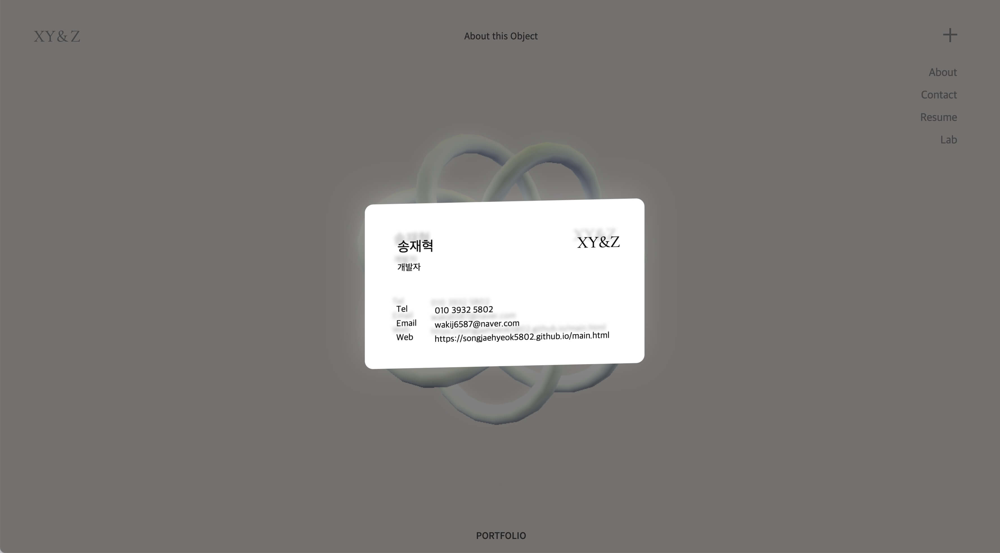

### Project Page
프로젝트 페이지입니다.    
상단에는 프로젝트의 이름과 썸네일을 배치하였습니다.     
스크롤을 하면 해당 정보와 이미지, 영상, PDF 파일을 볼 수 있게 하였습니다.     
정보 전달이 주가 되는 페이지이기에 3D 오브젝트는 제외하여 시선이 분산되는 것을 방지하였습니다.     
하단에는 다음 페이지로 이동할 수 있게 하였고, 총 5개의 페이지를 제작하였습니다.     

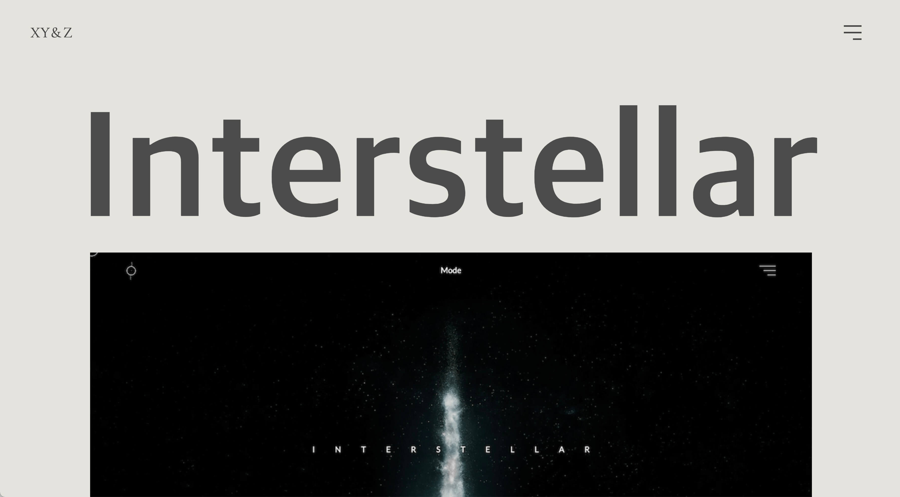
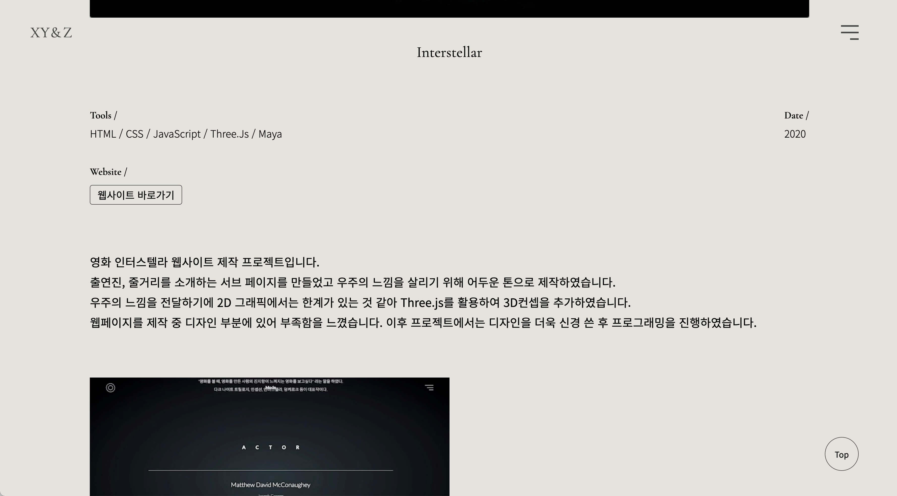
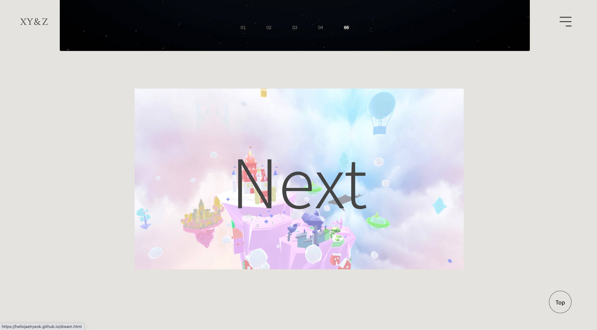

### About Page
사진과 저의 이야기를 적어놓은 페이지입니다.     
3D 오브젝트를 배치하였지만 시선이 분산되어 프로젝트 페이지와 동일하게     
제거하였습니다. 좌측에는 이미지를 배치하였고 마우스 호버 시 바뀌는 효과를 적용하였습니다.     

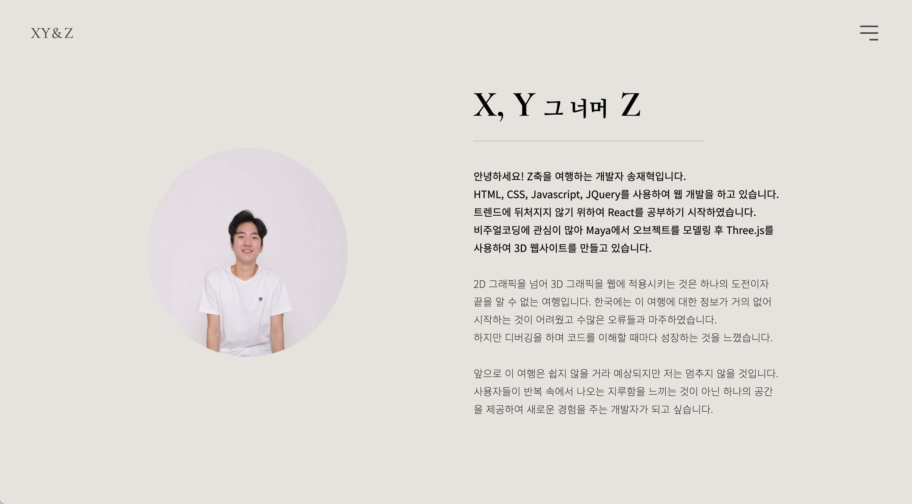

### Lab Page   
학교에서 진행하였던 프로젝트외에 개인적으로 했던 코드들을 보여주기위하여 만든 페이지입니다.     
이전 웹페이지들과는 다른 분위기를 연출하고자 색을 반전시켰고 3D 오브젝트를 변경하였습니다.     
레이아웃은 메인페이지와 동일하게 잡았습니다.     

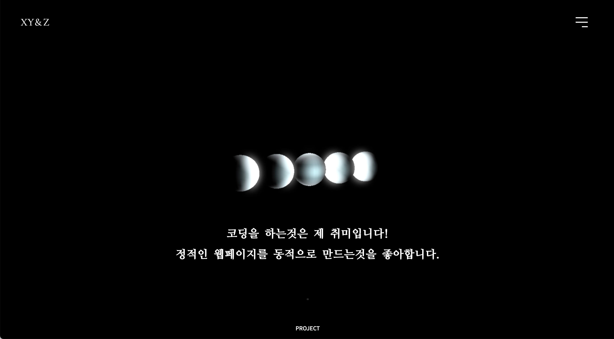
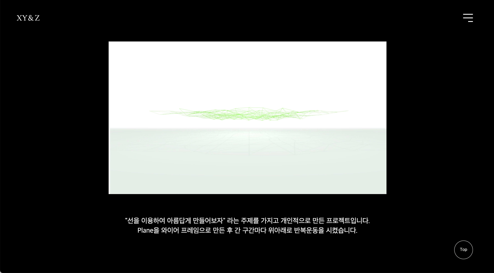
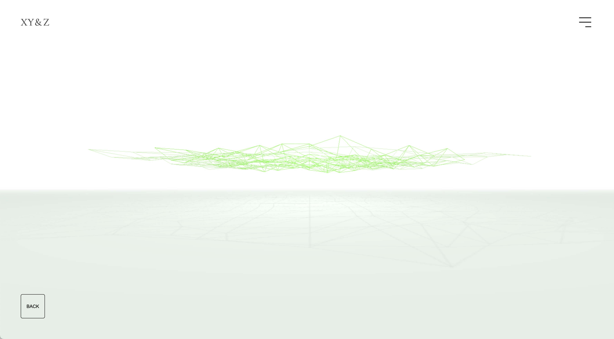
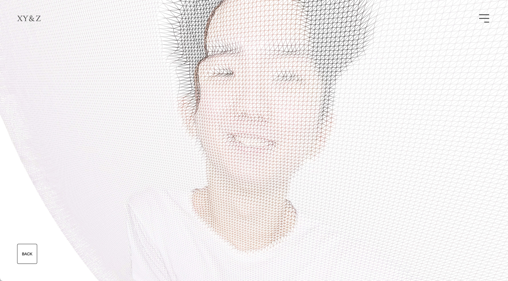
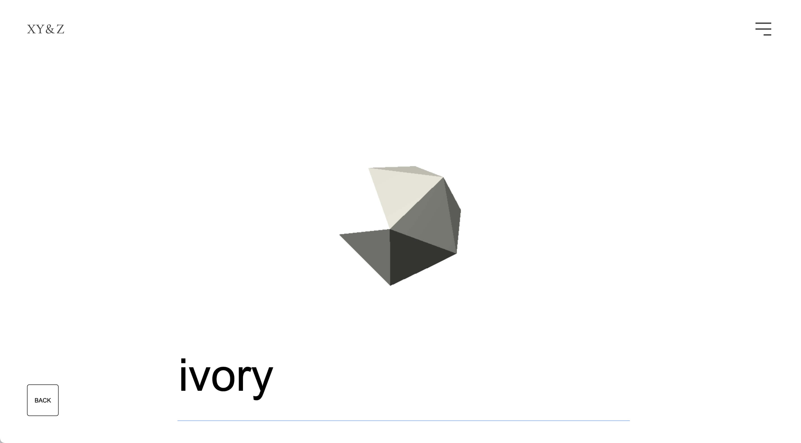
